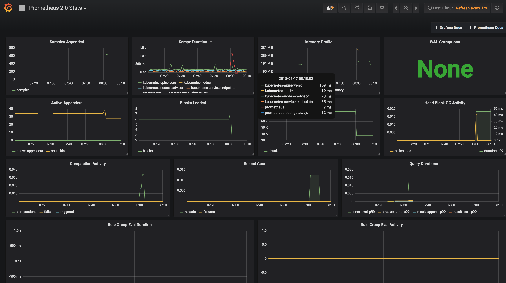

##What is Prometheus

Prometheus is an opensource monitoring and alerting toolkit originally built at soundcloud.
- Open source 
- Pull Based Monitoring
- Multi-dimentional data model/Time Series Database
- Powerful query language for evaluating time series data
- Inspired by borgmon

---

##What do Prometheus metrics look like?

```
node_filesystem_free{app="prometheus",chart="prometheus-6.6.1",component="node-exporter",device="/dev/xvda1",fstype="ext4",heritage="Tiller",instance="10.189.124.76:9100",job="kubernetes-service-endpoints",kubernetes_name="monitoring-prometheus-node-exporter",kubernetes_namespace="kube-monitoring",mountpoint="/",release="monitoring"} 121909030912
```

---

##Alerting
Prometheus has a component called alert-manager, alert manager is responsible for alerting based on queries that you define.  It supports integration with PagerDuty, Slack and many other alerting tools

```
ALERT PreditciveHostDiskSpace
  IF predict_linear(node_filesystem_free{mountpoint="/"}[4h], 4*3600) < 0
    FOR 30m
      LABELS { severity = "warning" }
        ANNOTATIONS {
            summary = "Predictive Disk Space Utilisation Alert",
                description = "Based on recent sampling, the disk is likely to will fill on volume {{ $labels.mountpoint }} within the next 4 hours for instance: {{ $labels.instance }}",
                  }
```
This is an example alert that based on a linear prediction of the disk space used we will alert when we know that a disk will fill up in 4 hours

---

##Third Party Exporters
Since Prometheus is a pull based it relies on the application you are monitoring exposing metrics formatted appropriately.  In order to simplify this there are third party exporters for, many many systems such as: docker, kubernetes, nginx, memcachd, mysql, redis, sqs, cloudwatch

---

## Custom Metrics
No one knows your applications better then you.  Engineers can instrument custom metrics via a `/metrics` endpoint.  Prometheus will be configured to scrape those metrics

---

## Grafana

Now that we have a robust query language and the mertrics to query we can create awesome dashboards like this

